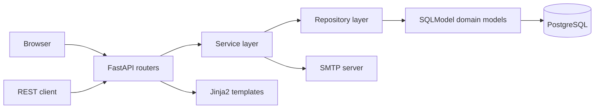
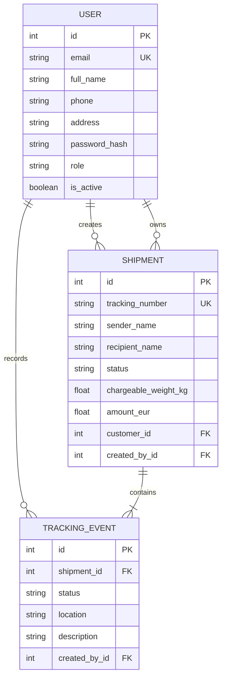

# Courier App Demo

Courier App Demo is a bilingual, server-rendered web application for managing
in-store courier shipments. Staff can register parcels, calculate chargeable
weight, issue vouchers, update shipment status, and send tracking emails.
Customers can create accounts, maintain profile information, review linked
shipments, and track parcels without logging in.

The project was built for the AUEB Coding Factory final assignment. It includes
a domain model, a model-backed PostgreSQL database, layered backend
architecture, a REST API, server-side rendering, authentication,
authorization, Swagger documentation, Docker support, and automated tests.

## Main features

- Public parcel tracking with a complete event timeline
- Customer registration, profile management, password changes, and shipment history
- Employee shipment creation and controlled status transitions
- Volumetric and chargeable weight calculation
- Printable voucher and receipt pages
- Voucher email delivery through SMTP
- Employee and administrator account management
- Greek and English user interfaces
- Role-based authorization for Customer, Employee, Admin, and Supervisor accounts
- REST shipment API documented through Swagger
- CSRF protection for all state-changing HTML forms
- JWT session tokens stored in HttpOnly cookies

## Architecture

The application uses a layered architecture. Routers act as controllers,
services contain business rules, repositories handle persistence, SQLModel
classes define the domain and database schema, and Jinja2 templates render the
browser interface.



Important directories:

- `app/routers/`: HTML controllers and REST endpoints
- `app/services/`: authentication, shipment rules, and email delivery
- `app/repositories/`: user, shipment, and tracking-event persistence
- `app/models/`: SQLModel domain and database models
- `app/schemas/`: Pydantic request and response validation
- `app/templates/`: Jinja2 server-rendered pages
- `app/static/`: local CSS and static assets
- `tests/`: unit and integration tests

## Domain model



Every shipment receives a unique tracking number and an initial tracking event.
Later status changes append immutable tracking events. The current shipment
status and its event history are saved in the same database transaction.

Valid status transitions are:

- Created to Picked up or Cancelled
- Picked up to In transit or Cancelled
- In transit to Out for delivery or Cancelled
- Out for delivery to Delivered or Failed delivery
- Failed delivery to Out for delivery or Cancelled
- Delivered and Cancelled are final states

## Account roles

- **Customer:** manages a personal profile and sees shipments linked to the
  account email. Registration also links earlier unassigned shipments with the
  same sender email.
- **Employee:** creates shipments, reviews shipment details, sends vouchers,
  and updates tracking status.
- **Admin:** has all Employee permissions and manages Employee accounts.
- **Supervisor:** has all staff permissions and manages Employee and Admin
  accounts.

The first Supervisor is created through `/setup`. The setup route is disabled
after a Supervisor exists. Public registration always creates a Customer and
never accepts a role from the browser.

## Technology stack

- Python 3.12
- FastAPI
- SQLModel and SQLAlchemy
- PostgreSQL 17
- Pydantic
- Jinja2
- Bootstrap and local CSS
- pwdlib with Argon2 password hashing
- PyJWT
- Psycopg
- Docker and Docker Compose
- Mailpit for local email testing
- pytest and HTTPX2 for automated tests

## Prerequisites

The recommended setup requires:

- Docker Desktop with Docker Compose
- A modern web browser

Running the FastAPI process outside Docker also requires Python 3.12.

## Quick start with Docker

Open PowerShell in the project directory and create a local environment file:

```powershell
Copy-Item .env.example .env
```

Replace `SECRET_KEY` in `.env` with a unique random value containing at least
32 characters. A value can be generated with Python:

```powershell
python -c "import secrets; print(secrets.token_urlsafe(48))"
```

Build and start the complete stack:

```powershell
docker compose up --build -d
```

Docker Compose starts:

- FastAPI application: `http://localhost:8001`
- Initial Supervisor setup: `http://localhost:8001/setup`
- Swagger UI: `http://localhost:8001/docs`
- OpenAPI schema: `http://localhost:8001/openapi.json`
- Mailpit inbox: `http://localhost:8025`
- PostgreSQL: `localhost:5432`

Check service health:

```powershell
docker compose ps
```

View application logs:

```powershell
docker compose logs -f application
```

Stop the stack while preserving PostgreSQL data:

```powershell
docker compose down
```

The `courier_postgres_data` named volume keeps users, shipments, and tracking
events between restarts. Use `docker compose down -v` only when the local data
must be permanently removed.

## Local Python development

Copy the example configuration and start only PostgreSQL and Mailpit:

```powershell
Copy-Item .env.example .env
docker compose up -d database mailpit
```

Create and activate a virtual environment:

```powershell
py -3.12 -m venv .venv
.\.venv\Scripts\Activate.ps1
python -m pip install --upgrade pip
python -m pip install -e .
python -m pip install pytest pytest-cov httpx2
```

Start FastAPI with automatic reload:

```powershell
python -m uvicorn app.main:app --reload --port 8001
```

## Configuration

Settings are loaded from environment variables and the optional `.env` file.

- `APP_NAME`: title used by FastAPI and Swagger
- `ENVIRONMENT`: `development`, `test`, or `production`
- `SECRET_KEY`: signs JWT session tokens
- `DATABASE_URL`: SQLAlchemy database connection URL
- `POSTGRES_DB`: Docker PostgreSQL database name
- `POSTGRES_USER`: Docker PostgreSQL user
- `POSTGRES_PASSWORD`: Docker PostgreSQL password
- `ACCESS_TOKEN_EXPIRE_MINUTES`: authenticated session lifetime
- `COOKIE_SECURE`: enables HTTPS-only authentication and CSRF cookies
- `VOLUMETRIC_DIVISOR`: divisor used for volumetric weight
- `PUBLIC_BASE_URL`: public URL inserted into tracking emails
- `SMTP_HOST` and `DOCKER_SMTP_HOST`: SMTP host for local and Docker execution
- `SMTP_PORT`: SMTP server port
- `SMTP_USERNAME` and `SMTP_PASSWORD`: optional SMTP credentials
- `SMTP_FROM_EMAIL`: sender address used for voucher messages
- `SMTP_USE_TLS`: enables SMTP STARTTLS

When `ENVIRONMENT=production`, startup rejects weak secrets and requires
`COOKIE_SECURE=true`.

## Authentication and security

Passwords are hashed with Argon2. Successful login creates a signed JWT in an
HttpOnly cookie. The token contains an expiry time and a password version, so
changing or resetting a password invalidates previously issued sessions.

All state-changing HTML forms use a per-browser CSRF token. The REST API accepts
JSON and uses the same authenticated staff cookie. Swagger documents the cookie
security scheme. To use protected operations in Swagger, first log in as a
staff user through `/login`, then open `/docs` in the same browser.

For local HTTP development, set `COOKIE_SECURE=false`. For HTTPS deployment,
set:

```dotenv
ENVIRONMENT=production
COOKIE_SECURE=true
```

## REST API

The shipment API is available under `/api/shipments`:

- `GET /api/shipments`: list shipments
- `POST /api/shipments`: create a shipment
- `PATCH /api/shipments/{shipment_id}/status`: update shipment status

All API operations require an authenticated Employee, Admin, or Supervisor.
API-created shipments are linked to an existing active Customer when the sender
email matches the customer account.

## Validation and business rules

- Greek landline numbers must contain 10 digits and start with `2`.
- Greek mobile numbers must contain 10 digits and start with `69`.
- `+30` and `0030` phone prefixes are accepted and normalized.
- Addresses must contain a street number.
- Weight and parcel dimensions must be positive and within configured limits.
- Volumetric weight is calculated as length × width × height ÷ divisor.
- Chargeable weight is the larger of actual and volumetric weight.
- The displayed amount is indicative; payment is completed through an external
  POS and is not processed by this application.

## Automated tests

The tests use isolated in-memory SQLite databases. They do not modify local
PostgreSQL data and do not send real email.

Run the complete suite without writing pytest cache files:

```powershell
.\.venv\Scripts\python.exe -m pytest -p no:cacheprovider
```

The suite covers shipment rules, validation, HTML routes, REST routes,
authentication, authorization, CSRF protection, password-based session
invalidation, staff-management boundaries, customer linking, Greek text, and
OpenAPI security metadata.

Generate a coverage report:

```powershell
.\.venv\Scripts\python.exe -m pytest --cov=app --cov-report=term-missing -p no:cacheprovider
```

## Build and deployment

Build the application image without starting containers:

```powershell
docker compose build
```

Start a deployment:

```powershell
docker compose up --build -d
```

Before a public deployment:

1. Set `ENVIRONMENT=production`.
2. Use a unique `SECRET_KEY` with at least 32 characters.
3. Set `COOKIE_SECURE=true`.
4. Set `PUBLIC_BASE_URL` to the HTTPS application address.
5. Use strong PostgreSQL credentials.
6. Replace Mailpit with a production SMTP provider.
7. Place FastAPI behind an HTTPS reverse proxy.
8. Do not expose PostgreSQL or development SMTP ports to the internet.
9. Configure database backups, application logging, and monitoring.
10. Introduce versioned database migrations before evolving a production
    schema.

The current Docker Compose file is intended for local development,
demonstration, and academic evaluation. Production port exposure, reverse proxy
configuration, backups, and infrastructure monitoring depend on the target
server.

## Final-project requirement coverage

The project includes:

- A courier domain model and a database generated from SQLModel metadata
- Repository, Service, and Controller layers
- A REST API and Jinja2 server-side rendering
- Backend and browser authentication and authorization
- Swagger and OpenAPI documentation
- Unit and integration tests
- PostgreSQL and application execution through Docker Compose
- Detailed build and deployment instructions
